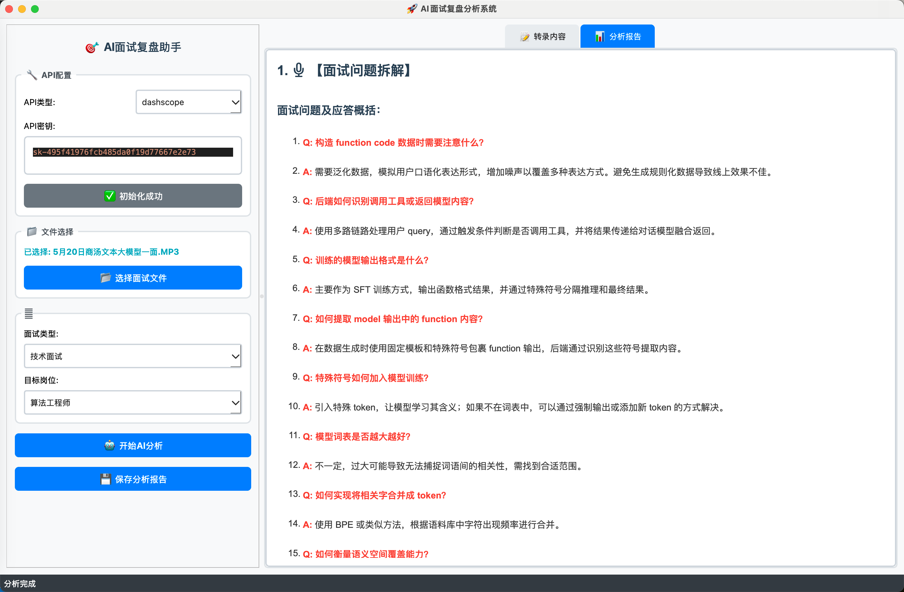
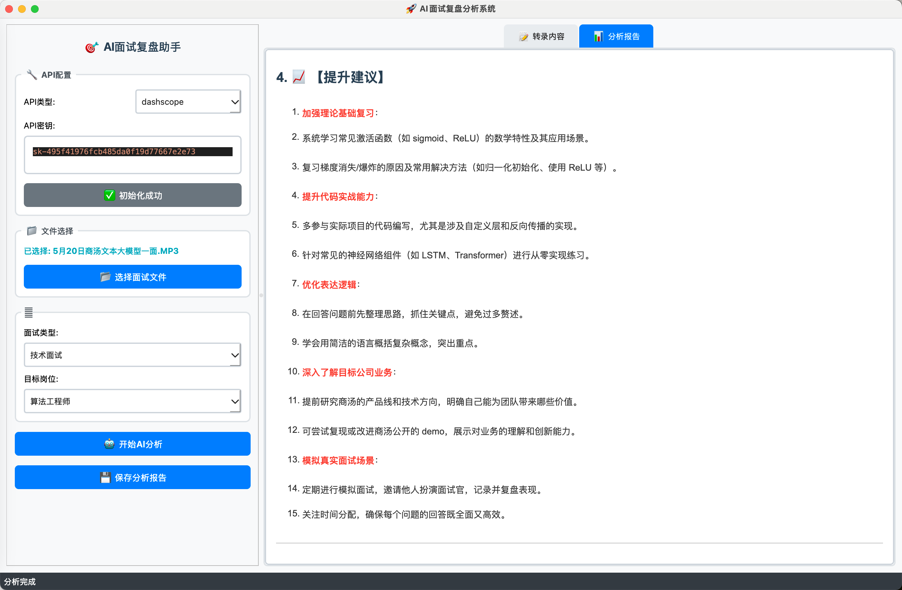
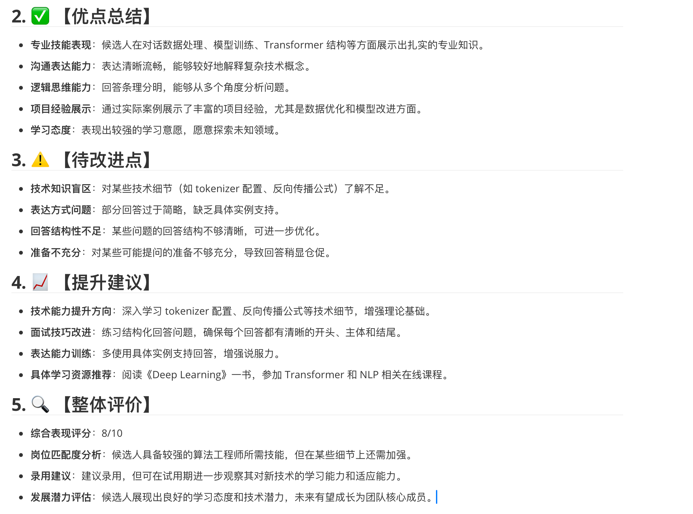

# 🎤 AI 面试复盘助手（AI Interview Reviewer）

借助语音识别与大语言模型技术，本工具可帮助你快速完成面试录音的自动复盘分析，包括：

- 自动转写中文面试录音（支持 mp3/wav）
- 分析你的表达亮点、常见问题与优化建议
- 输出结构化的 AI 面试反馈报告

---

## 🚀 功能亮点

✅ 支持上传中文面试录音  
✅ Whisper + 大语言模型自动分析  
✅ 一键生成结构化复盘报告  
✅ 可本地运行，无需上传隐私数据  

---

## 📦 环境依赖

请先安装依赖环境（建议 Python 3.8+）：

```bash
pip install -r requirements.txt 
```

## 🔐 配置 API Key
你需要配置以下两个服务的 API Key，用于语音识别与大模型调用：

1️⃣ Whisper语音转写 API（SILICON）
免费申请地址：https://cloud.siliconflow.cn/account/ak

获取后，在项目根目录创建 .env 文件，并添加：

2️⃣ 大模型接口（阿里百炼 DashScope）
开通地址：https://bailian.console.aliyun.com/?tab=model#/api-key

获取后，在 .env 文件中继续添加：


## 🧪 快速开始
确保你已设置好 .env 和安装好依赖，然后运行：

```bash
python main.py
```


## ✨ 示例效果图








## 📮 联系与反馈

如果你在使用过程中遇到任何问题，欢迎提交 Issue 或联系作者。vx: grit-h